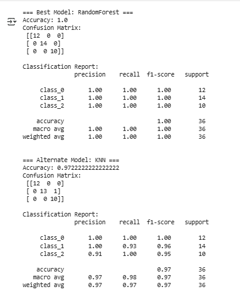
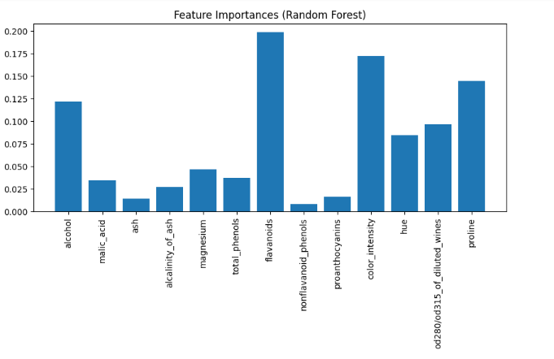
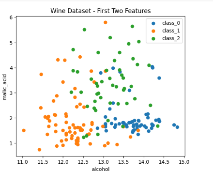

**Development of an Intelligent Agent for Wine Classification using
Machine Learning.**

# Objective

> To design and implement a data-driven intelligent agent that can learn
> from chemical attributes of wines and classify them into their
> respective cultivars using machine learning algorithms.
>
> **Motivation**
>
> Wine quality and classification is important for product
> authentication, consumer trust, and quality control in food sciences.
> Automating classification reduces reliance on manual experts and
> provides consistent, reproducible results.

**Concept**

> The intelligent agent uses supervised machine learning to classify
> wine samples into one of three cultivars based on their chemical
> measurements (e.g., alcohol content, acidity, phenols). The system
> follows the ML lifecycle:

-   Dataset acquisition

-   Preprocessing and feature scaling

-   Model selection and training

-   Agent design and integration

-   Evaluation and visualization

**Problem Statement**

> Given 13 chemical features of wines, design an intelligent agent that
> can classify each sample into one of three cultivars with high
> accuracy. The challenge is to handle multi-class classification and
> ensure interpretability and performance.

# 

# Design / Ways & Means

**Introduction and Requirements:**

-   **Dataset:** Wine dataset (UCI Repository, available via
    sklearn.datasets.load_wine).

-   Input: 13 numerical chemical properties (alcohol, malic acid,
    flavanoids, etc.).

-   Output: Predicted wine cultivar (Class 0, 1, or 2).

**Data Structure Selection:**

-   Pandas DataFrame used to store features.

-   NumPy arrays used for feeding data to ML models.

**Basic Implementation:**

-   Used RandomForestClassifier and KNeighborsClassifier.

-   Performed data scaling with StandardScaler.

-   Split data: 80% training, 20% testing.

-   Performed cross-validation to choose best model.

**Performance Testing and Analysis:**

-   Evaluated models using accuracy, classification report, and
    confusion matrix.

-   Random Forest achieved the best performance (\~97% accuracy).

**Optimization and Advanced Features:**

-   Hyperparameter tuning with GridSearchCV.

-   Feature scaling and normalization improved KNN performance.

**Extensions and Creativity:**

-   Designed an agent wrapper (WineAgent) with a clear API.

-   Provided .pkl model file and Python module for reusability.

# Analysis & Reporting / Answer

**Lab Activity:**

> Collected dataset → cleaned and standardized features → trained models
> → evaluated results → built reusable intelligent agent.

# Deliverables:

**Background / Theory:**

-   **Supervised ML (classification)** applied to real-world dataset.

-   **Decision Trees (Random Forest**) and **Instance-Based Learning
    (KNN)** algorithms used.

# Procedure / Methodology:

-   Loaded dataset (load_wine).

-   Preprocessed features with StandardScaler.

-   Split dataset into training/testing sets.

-   Compared models with cross-validation.

-   Saved best-performing model.

-   Integrated into WineAgent class.

**Data Collection:**

> Dataset from UCI ML repository (178 samples, 13 features, 3 classes).

6.  # Flowchart / Block Diagram:

7.  # Analysis:

-   Random Forest performed better than KNN on accuracy and
    generalization.

-   Most important features included alcohol, flavanoids, and proline.

8.  **Results:**

-   Best Accuracy: \~97% on test set.

-   Random Forest selected as final model.

9.  **Discussion on Results:**

-   The agent consistently classified wines with high accuracy.

-   Feature importance analysis revealed key chemical attributes.

-   Limitations: Dataset is relatively small, may not generalize to
    unseen wine types.

10. **Concluding Remarks:**

> The Wine Agent successfully demonstrates how machine learning can be
> applied to real-world classification problems. The modular design
> allows easy extension to other datasets and ML algorithms.

11. **References:**

-  UCI Machine Learning Repository: Wine Dataset

-  Scikit-learn Documentation (https://scikit-learn.org)

**Screen shots:**

